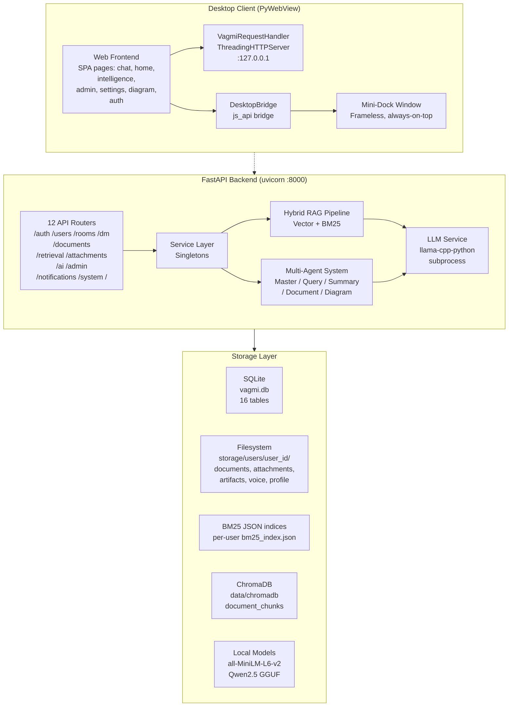
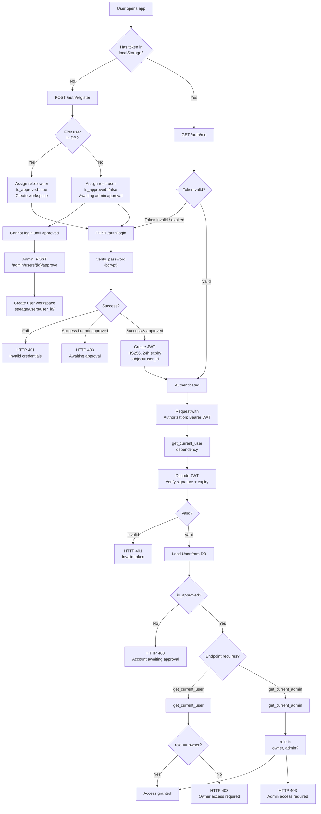
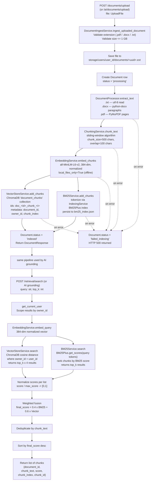
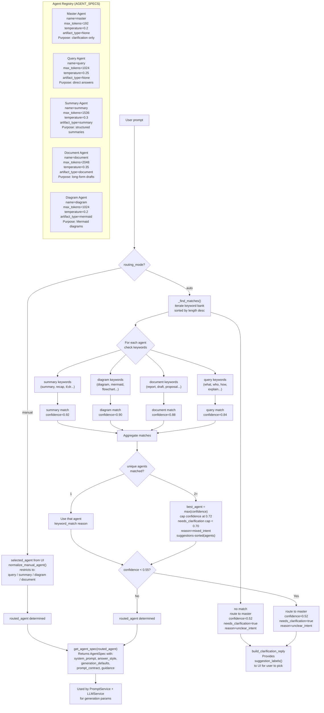
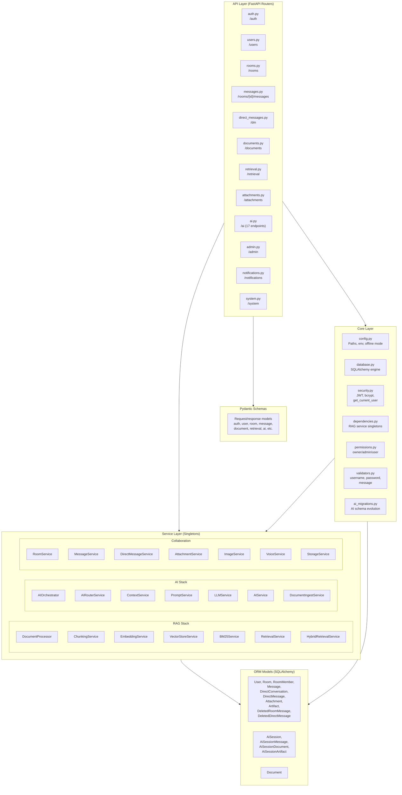
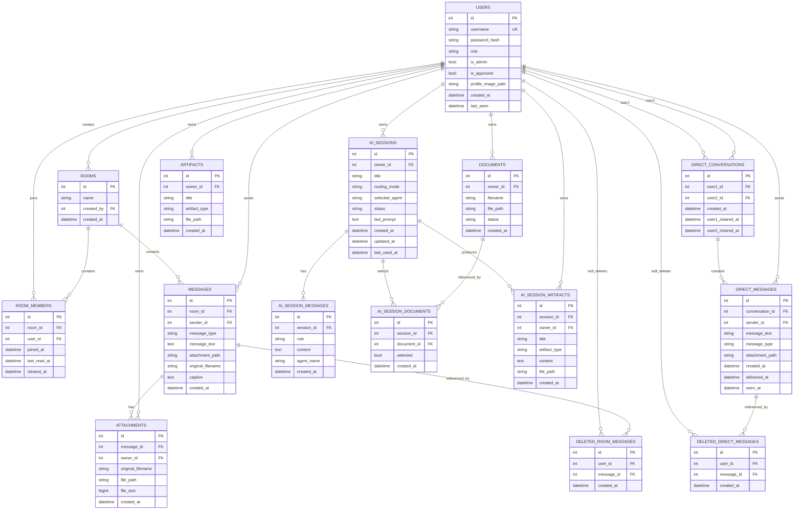
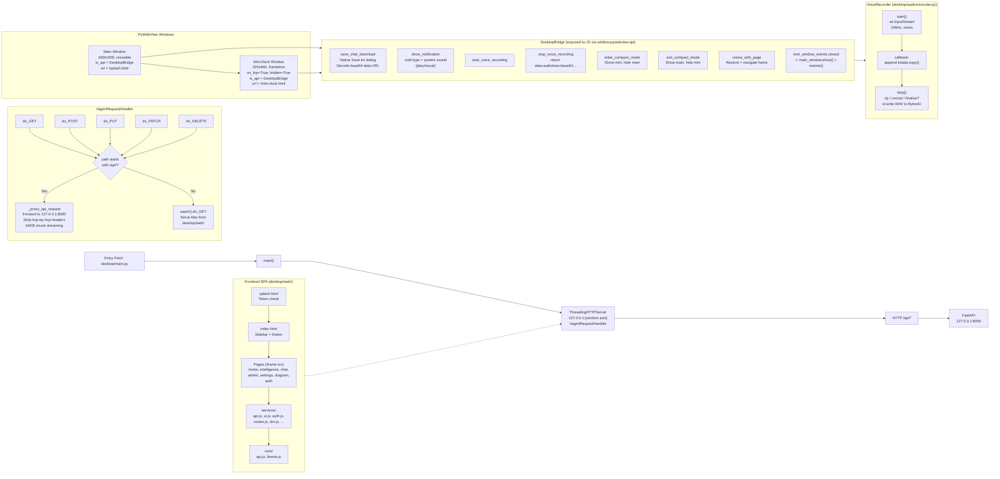

<p align="center">
  
</p>

<h1 align="center">Vāgmi</h1>

<p align="center">
  <strong>Offline Multi-Agent Intelligence Platform</strong><br>
  <em>Built for Secure & Air-Gapped Work Environments</em>
</p>

<p align="center">
  
  
  
  
  
  
</p>

---

**Offline Multi-Agent Intelligence Platform for Secure Work Environments**

Vāgmi is a fully offline, LAN-deployable intelligence platform designed for secure workplaces where internet connectivity, cloud services, and external APIs are unavailable or restricted.

The platform combines document intelligence, local multi-agent AI, team collaboration, and diagram generation into a single self-hosted desktop application. Originally designed for deployment within air-gapped environments such as DRDO facilities, Vāgmi prioritizes privacy, local processing, user isolation, and operational simplicity while providing a modern AI-assisted workflow experience.

---

## Overview

Organizations operating in secure environments often face a common challenge:

* Documents are scattered across multiple formats.
* Knowledge remains siloed within teams.
* Existing AI solutions depend on cloud services.
* Collaboration tools require internet connectivity.
* Generating diagrams and structured content is repetitive and time-consuming.

Vāgmi addresses these challenges through a centralized offline intelligence platform that runs entirely on local infrastructure. Users can upload documents, chat with a local multi-agent AI grounded in their own files, generate Mermaid diagrams, and communicate with teammates through rooms and direct messages — all without any external network dependency, packaged as a native desktop app.

---

## High-Level Architecture



The desktop client (PyWebView) talks to a local FastAPI backend over `127.0.0.1`, which sits on a service layer of singletons covering the hybrid RAG pipeline, the multi-agent system, and the LLM service — all backed by SQLite, ChromaDB, per-user filesystem storage, and locally-stored models (all-MiniLM-L6-v2 for embeddings, Qwen2.5 GGUF for generation). Nothing in this loop touches the internet.

---

## Implemented

| Area | What works |
|---|---|
| **Authentication** | Registration, login (JWT, 24h expiry), `/auth/me`, per-user workspace creation on signup, first-user-becomes-owner bootstrap, admin approval workflow for subsequent users |
| **Documents** | Upload (`.pdf`, `.docx`, `.txt`, up to 1 GB), automatic background indexing into the RAG pipeline, document listing, status tracking (`processing` → `indexed` / `failed_indexing`) |
| **Retrieval** | Hybrid semantic + keyword search (`/retrieval/search`), scoped per-user, also used directly for AI grounding |
| **AI Intelligence** | Session-based chat grounded in selected documents, backed by a local multi-agent system with intent routing (Master / Query / Summary / Diagram / Document agents), running fully offline on a local LLM — 17 endpoints under `/ai` |
| **Diagram Generation** | Mermaid-based diagram studio in the desktop client — type or generate a flow and render it live, with SVG/PNG export |
| **Collaboration** | Rooms (create/list/get/delete), room membership management, room messages (text/image/voice), direct messages (1:1, text/image/voice), file attachments, user search, unread notifications |
| **Admin** | Pending-user approval, user management, admin role transfer, role-gated access (owner / admin / user) |
| **Desktop Client** | PyWebView-based native desktop app (auth, home, chat, intelligence, diagram, settings, admin, change-password pages), mini-dock floating window, native save dialogs, voice recording |
| **System** | Health check endpoint, offline-hosted Swagger UI (`/docs` served from local static assets, not the internet) |

---

## Authentication & Access Control


The first user to register on a deployment is automatically made the workspace **owner** (approved immediately, workspace provisioned right away). Every subsequent registration is created with `is_approved=false` and has to be approved by an admin before they can log in. Once approved, login issues a JWT (HS256, 24h expiry) that's verified on every request via a `get_current_user` dependency; role-gated endpoints layer `get_current_admin` / `require_owner` checks on top for admin- and owner-only actions.

---

## Retrieval Stack



The retrieval layer runs automatically whenever a document is uploaded (via `/documents/upload` or `/ai/documents/upload`):

```
Document (.txt / .pdf / .docx, up to 1GB)
        ↓
Text Extraction        (document_processor.py — PyMuPDF for PDF, python-docx for DOCX, utf-8 read for .txt)
        ↓
Chunking                (chunking_service.py — sliding window, chunk_size=500 chars, overlap=100 chars)
        ↓
Embeddings              (embedding_service.py — all-MiniLM-L6-v2, 384-dim, normalized, offline / local_files_only)
        ↓
ChromaDB                (vector_store_service.py — persistent, per-owner metadata filtering)
        ↓                                    ↘
Vector Retrieval                          BM25 Retrieval
(cosine distance, top k×4)                (BM25Plus, persisted to bm25_index.json per user)
        ↓                                    ↙
            Score normalization (score / max_score) + weighted fusion
            final_score = 0.4 × BM25_score + 0.6 × Vector_score
            deduplicate by chunk_text, sort by final score
                        ↓
    Final ranked chunks {document_id, chunk_text, score, chunk_index, chunk_id}
                        ↓
            Local Multi-Agent LLM Layer
```

If extraction, chunking, embedding, or indexing fails at any stage, the document is marked `failed_indexing` and the upload endpoint returns an HTTP 500 rather than silently leaving a partially-indexed document behind.

---

## Multi-Agent AI Layer



The intelligence module runs a fully offline, session-based multi-agent system on top of the retrieval stack. Each agent is defined as an `AgentSpec` (`agents/base.py`) with its own name, max tokens, temperature, artifact type, and purpose:

| Agent | Max tokens | Temperature | Artifact type | Purpose |
|---|---|---|---|---|
| **Master** | 192 | 0.2 | None | Clarification only — asks a question when intent is ambiguous |
| **Query** | 1024 | 0.25 | None | Direct answers, grounded in selected documents and recent conversation |
| **Summary** | 1536 | 0.3 | `summary` | Structured summaries — key ideas and takeaways |
| **Document** | 2048 | 0.35 | `document` | Long-form, polished markdown drafts |
| **Diagram** | 1024 | 0.2 | `mermaid` | Mermaid flowcharts / sequence diagrams |

**Routing** (`ai_router_service.py`) supports two modes:

* **Manual** — the user picks an agent (query/summary/diagram/document) directly from the UI; routing confidence is 1.0 and no clarification is needed.
* **Auto** — a keyword bank (summary/diagram/document/query keywords, longest phrases matched first) is scanned against the prompt. A single matching agent routes directly at its base confidence (0.84–0.92). Multiple matching agents route to the best-scoring one, with confidence capped at 0.72 and reason `mixed intent`. No matches route to the Master agent for clarification (confidence 0.52, reason `unclear intent`).

### Orchestration flow

```mermaid
flowchart TB
  U["User submits prompt<br/>in Intelligence UI"]
  P["POST<br/>/ai/sessions/{id}/messages<br/>{prompt, routing_mode?,<br/>selected_agent?}"]
  A1["ai_service.run_chat_turn"]
  A2["AIOrchestrator.run_session_turn"]

  U --> P --> A1 --> A2

  A2 --> S1["1. ROUTE"]
  S1 --> RM{"routing mode?"}

  RM -->|manual| MAN["use selected_agent<br/>confidence=1.0<br/>needs_clarification=false"]
  RM -->|auto| AUTO["AIRouterService._find_matches()<br/>keyword bank lookup<br/>longest first"]

  AUTO --> AM{"Any match?"}
  AM -->|1 unique| MTA["route to matched agent<br/>confidence =<br/>max_confidence<br/>(0.84, 0.92?)"]
  AM -->|2+ unique| BTA["route to best agent<br/>confidence capped at 0.72<br/>reason: mixed_intent"]
  AM -->|No| MST["route to master<br/>confidence=0.52<br/>needs_clarification=true<br/>reason: unclear intent"]

  MAN --> S2
  MTA --> S2
  BTA --> S2
  MST --> CL1

  S2["2. BUILD CONTEXT"]
  S2 --> C1["ContextService.build_session_context"]
  C1 --> C2["Load selected_documents<br/>from AiSessionDocument join"]
  C2 --> C3["Load recent_messages<br/>last 10 from AiSessionMessage"]

  C3 --> S3
  S3["3. ASSEMBLE PROMPT"]
  S3 --> G1["retrieve_grounding_chunks<br/>HybridRetrievalService.search<br/>Filter to selected_doc_ids<br/>Limit: 12 chunks<br/>Truncate text to 1200 chars"]
  G1 --> B1["PromptService.build_prompt_messages"]

  B1 --> UM["User message = prompt"]
  B1 --> SM["System message<br/>Identity: session metadata +<br/>agent spec + guidance +<br/>contract + selected documents +<br/>retrieved passages +<br/>recent messages + answer rules"]

  B1 --> S4
  S4["4. CLARIFICATION CHECK"]
  S4 --> CL{"needs clarification?"}

  CL -->|Yes| CL1["build_clarification_reply<br/>'I need a little more direction'<br/>+ suggestion labels"]
  CL -->|No| S5

  S5["5. GENERATE REPLY"]
  S5 --> L1["LLMService.generate_local_reply"]
  L1 --> WR{"Worker ready?"}

  WR -->|No| W1["_ensure_worker<br/>spawn subprocess<br/>load GGUF via llama-cpp-python<br/>multiprocessing Pipe"]
  WR -->|Yes| INF

  W1 --> INF["_INFERENCE_LOCK<br/>Send prompt to worker<br/>Wait up to 600s"]
  INF --> LF{"LLM fails?"}

  LF -->|Yes| GR["build_grounded_reply<br/>Select snippets from<br/>grounding chunks<br/>Add citations list"]
  LF -->|No| S6

  S6["6. PERSIST TURN"]
  S6 --> PT["persist_turn<br/>1. Save AiSessionMessage role=user<br/>2. Save AiSessionMessage role=assistant<br/>3. Create AiSessionArtifact if applicable<br/>4. Update session.last_prompt, status"]
  PT --> SP["session_payload<br/>full session shape"]
  SP --> RSP["AiChatResponse<br/>(session, routed_agent,<br/>confidence, needs_clarification,<br/>reply, sources, citations,<br/>artifact_type, artifact_title)"]
  RSP --> UI["Render in Intelligence UI"]

  CL1 --> PT
  GR --> PT
```



`AiOrchestrator.run_session_turn` drives a full turn in six steps:

1. **Route** — determine the agent per the routing rules above.
2. **Build context** — `ContextService.build_session_context` loads the session's selected documents and the last 10 messages.
3. **Assemble prompt** — `HybridRetrievalService.search` retrieves up to 12 grounding chunks (truncated to 1200 chars each) scoped to the session's selected documents; `PromptService.build_prompt_messages` assembles the system message (identity, session metadata, agent guidance/contract, selected documents, retrieved passages, recent messages, and answer rules).
4. **Clarification check** — if the router flagged `needs_clarification`, a clarification reply with suggested agent labels is returned immediately, skipping generation.
5. **Generate reply** — `LLMService.generate_local_reply` ensures the local model worker is running, sends the prompt, and waits up to 600s for a response; on failure it falls back to a grounded, non-LLM reply built by selecting supporting sentences directly from the retrieved chunks (with citations).
6. **Persist turn** — the user message, assistant reply, and any generated artifact (Mermaid diagram / document / summary) are saved, and the session's `last_prompt`/status are updated before the full session payload is returned to the UI.

### Local inference

**Local inference** (`llm_service.py`) runs a GGUF-quantized model via `llama-cpp-python`, hosted in an isolated worker process (spawned via `multiprocessing`, communicating over a `Pipe`) so the main API server stays responsive during generation. The worker:

* Resolves a local GGUF model file (`VAGMI_AI_MODEL_PATH` override, or auto-discovery in the configured models directory — currently targeting Qwen2.5 7B/3B instruct, quantized).
* Loads the model once and keeps it warm across requests, with GPU offload where available (`n_gpu_layers`) and flash attention enabled.
* Does token-based context truncation (not naive character truncation) to fit the model's context window while preserving the system prompt and most recent turns.
* Cleans model output (de-duplicates repeated lines/sentences, strips boilerplate prefixes and prompt echoes) before it reaches the client.

If no local model is available, the intelligence module falls back to the deterministic, non-LLM grounded-reply path described above rather than failing outright — useful for demoing the UI/session flow on a machine without a model file present, though it does not carry the same quality as a live model.

---

## API Reference



The backend is organized into 12 API routers over an API / service / core / model layering:

* **API layer** — `auth`, `users`, `rooms`, `messages`, `direct_messages`, `documents`, `retrieval`, `attachments`, `ai` (17 endpoints), `admin`, `notifications`, `system`.
* **Service layer (singletons)** — the RAG stack (`DocumentProcessor`, `ChunkingService`, `EmbeddingService`, `VectorStoreService`, `BM25Service`, `RetrievalService`, `HybridRetrievalService`), the AI stack (`AiOrchestrator`, `AiRouterService`, `ContextService`, `PromptService`, `LlmService`, `AiService`, `DocumentIngestService`), and the collaboration layer (`RoomService`, `MessageService`, `DirectMessageService`, `AttachmentService`, `ImageService`, `VoiceService`, `StorageService`).
* **Core layer** — `config.py` (paths, env, offline mode), `database.py` (SQLAlchemy engine), `security.py` (JWT, bcrypt, current-user resolution), `dependencies.py` (RAG service singletons), `permissions.py` (owner/admin/user checks), `validators.py` (username/password/message validation), `ai_migrations.py` (AI schema evolution).
* **ORM models** — `User`, `Room`, `RoomMember`, `Message`, `DirectConversation`, `DirectMessage`, `Attachment`, `Artifact`, `DeletedRoomMessage`, `DeletedDirectMessage`, `Document`, `AiSession`, `AiSessionMessage`, `AiSessionDocument`, `AiSessionArtifact` — 16 tables total in `vagmi.db`.

All routes (except `/`, `/health`, `/auth/register`, `/auth/login`) require a bearer token obtained from `/auth/login`.

| Method | Endpoint | Description |
|---|---|---|
| POST | `/auth/register` | Create a new user and provision their workspace (first user becomes owner) |
| POST | `/auth/login` | Authenticate and receive a JWT access token |
| GET | `/auth/me` | Get the current authenticated user |
| POST | `/documents/upload` | Upload a document; triggers extraction → chunking → embedding → ChromaDB + BM25 indexing |
| GET | `/documents` | List the current user's documents and their indexing status |
| POST | `/retrieval/search` | Hybrid search (vector + BM25) over the current user's indexed documents |
| GET | `/ai/status` | Local model / AI subsystem status |
| GET / POST | `/ai/sessions` | List / create AI chat sessions |
| GET / PATCH / DELETE | `/ai/sessions/{id}` | Get, rename, or delete a session |
| PUT | `/ai/sessions/{id}/documents` | Attach documents to a session for grounding |
| GET | `/ai/sessions/{id}/messages` | Session message history |
| GET | `/ai/sessions/{id}/context` | Retrieved context for the current session |
| GET / DELETE | `/ai/sessions/{id}/artifacts` | List / delete generated artifacts (diagrams, summaries, documents) |
| POST | `/ai/sessions/{id}/messages` | Send a message; routed to the appropriate specialist agent |
| POST | `/ai/sessions/{id}/regenerate` | Regenerate the last AI response |
| POST | `/ai/chat` | One-off chat call outside a persisted session |
| POST | `/rooms` / GET `/rooms` | Create / list rooms |
| GET / DELETE | `/rooms/{id}` | Get / delete a room |
| POST / GET / DELETE | `/rooms/{id}/members` | Manage room membership |
| POST | `/rooms/{id}/messages`, `/messages/image`, `/messages/voice` | Send text / image / voice messages in a room |
| GET | `/rooms/{id}/messages` | Room message history |
| POST / GET | `/dm` | Start / list direct conversations |
| POST | `/dm/{id}/messages`, `/messages/image`, `/messages/voice` | Send text / image / voice direct messages |
| GET | `/dm/{id}/messages` | Direct message history |
| POST / GET | `/attachments` / `/attachments/{id}` | Upload / download file attachments |
| GET | `/users/search?query=` | Search for other users by username |
| GET | `/notifications/chat-unread` | Unread chat notification counts |
| GET / POST / DELETE | `/admin/*` | Pending-user approval, user management, admin role transfer |
| GET | `/health` | Health check |
| GET | `/docs` | Offline-hosted Swagger UI |

Interactive, locally-served API documentation is available at `/docs` once the server is running — it loads its JS/CSS from local static assets rather than a CDN, keeping it usable in air-gapped environments.

---

## Data Model



The schema spans users, rooms and room membership, room/direct messages (text, image, voice, file types) with soft-delete tracking per conversation, attachments, and the full AI session subsystem (`AiSession` → `AiSessionMessage` / `AiSessionDocument` / `AiSessionArtifact`), where sessions carry a routing mode (manual/auto), a selected agent, and status (active/archived).

---

## Desktop Client



The entry point (`desktop/main.py`) starts a `ThreadingHTTPServer` on a random local port running a custom `VagmiRequestHandler`, which either serves static files from `desktop/web/` or proxies `/api/*` requests to the FastAPI backend at `127.0.0.1:8000` (stripping hop-by-hop headers, streaming in 64KB chunks). The main PyWebView window (1600×1000, resizable) loads `splash.html` first for a token check, then `index.html` — a sidebar + iframe SPA with pages for home, intelligence, chat, admin, settings, and diagram.

A `DesktopBridge` object is exposed to the frontend via `window.pywebview.api`, providing native functionality: save-as dialogs for chat downloads, desktop notifications (`notify-py` + system sound), and voice recording control. Voice recording itself (`desktop/audio/recorder.py`) captures via `sounddevice` at 16kHz mono, concatenates frames on stop, and returns a base64-encoded WAV data URL.

The app also has a separate **mini-dock window** (320×460, frameless, always-on-top, hidden by default) that the user can pop into a compact mode — the main window hides and the mini-dock takes over, restoring back to the main window (with page state preserved) on close.

---

## Technology Stack

### Backend

* FastAPI, Uvicorn
* SQLAlchemy + SQLite (`aiosqlite`)
* Pydantic / pydantic-settings
* `python-jose` + `passlib`/`bcrypt` for JWT auth
* `python-multipart` for file uploads

### Retrieval / AI

* ChromaDB (persistent vector store)
* `sentence-transformers` — `all-MiniLM-L6-v2` (384-dim, fully offline)
* `rank-bm25` — keyword retrieval (BM25Plus)
* PyMuPDF (`fitz`) — PDF extraction
* `python-docx` — DOCX extraction
* `llama-cpp-python` — local GGUF inference (Qwen2.5 instruct, quantized), run in an isolated worker process
* `torch`, `transformers` — embedding backend support

### Desktop Client

* PyWebView (native window + local HTTP server bridge)
* Vanilla JS, HTML, CSS (no frontend framework)
* Mermaid.js — in-app diagram rendering
* `notify-py` — native desktop notifications
* `sounddevice` / `soundfile` — voice message recording

---

## Project Structure

```text
backend/
├── requirements.txt
├── requirements-lock.txt        # full pinned dependency set, incl. RAG + LLM stack
└── app/
    ├── main.py                  # app factory, router registration, offline Swagger
    ├── api/                     # auth, documents, retrieval, ai (17 endpoints), rooms,
    │                             # messages, direct_messages, attachments, users, admin,
    │                             # notifications, system
    ├── core/                    # config, constants, database, security, dependencies,
    │                             # permissions, validators, ai_migrations
    ├── models/                  # SQLAlchemy models — User, Document, Room, RoomMember,
    │                             # Message, DirectConversation, DirectMessage, Attachment,
    │                             # Artifact, DeletedRoomMessage, DeletedDirectMessage,
    │                             # AiSession, AiSessionMessage, AiSessionDocument,
    │                             # AiSessionArtifact (16 tables total)
    ├── schemas/                 # Pydantic request/response models
    ├── services/                # document_processor, chunking, embedding, vector_store,
    │                             # retrieval, indexing, bm25, hybrid_retrieval,
    │                             # ai_orchestrator, ai_router_service, ai_payload,
    │                             # llm_service, prompt_service, context_service, ai_service,
    │                             # document_ingest_service, message/room/storage/
    │                             # attachment/image/voice services
    ├── agents/                  # base.py (AgentSpec) + master, query, summary,
    │                             # document_generation, diagram_generation specs
    ├── scripts/                 # manual test scripts (extraction, chunking,
    │                             # embeddings, chromadb, retrieval, e2e)
    └── tests/                   # test_bm25.py, hybrid_test.py

desktop/
├── main.py                      # PyWebView bootstrap, VagmiRequestHandler, DesktopBridge
├── requirements.txt / requirements-lock.txt
├── audio/                       # voice recorder (sounddevice, 16kHz mono)
└── web/
    ├── index.html, splash.html, mini-dock.html
    ├── script.js, styles.css, theme.css
    ├── services/                 # api, auth, dm, rooms, desktop bridge helpers
    ├── core/
    └── pages/
        ├── auth/
        ├── home/
        ├── chat/                 # rooms + DMs, text/image/voice
        ├── intelligence/         # AI chat sessions, document grounding
        ├── diagram/               # Mermaid studio (script.js, mermaid.min.js)
        ├── settings/
        ├── change-password/
        └── admin/

docs/
└── diagrams/                    # architecture diagrams referenced in this README
```

---

## Getting Started

```bash
cd backend

# install the full, pinned dependency set (includes ChromaDB, sentence-transformers,
# rank-bm25, and llama-cpp-python)
pip install -r requirements-lock.txt

# place a compatible GGUF model (e.g. a quantized Qwen2.5 instruct build) in the
# configured local models directory, or point VAGMI_AI_MODEL_PATH at it directly

# run the server
uvicorn app.main:app --reload
```

The server creates its SQLite tables automatically on startup. The first user to register becomes the workspace owner. Visit `http://localhost:8000/docs` for the offline-hosted Swagger UI, or `http://localhost:8000/health` to confirm the service is running.

To run the desktop client:

```bash
cd desktop
pip install -r requirements-lock.txt
python main.py
```
